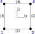

```@meta
DocTestSetup = :(using Ferrite)
```

# Grid
A Ferrite `Grid` can be generated with the [`Ferrite.generate_grid`](@ref) function. 
More advanced meshes can be imported with the 
[`FerriteMeshParser.jl`](https://github.com/Ferrite-FEM/FerriteMeshParser.jl) (currently for Abaqus .inp files),
or even created with the [`FerriteGmsh.jl`](https://github.com/Ferrite-FEM/FerriteGmsh.jl) package. 

In Ferrite a Grid is a collection of `Node`s and `Cell`s and is parameterized in its physical dimensionality and cell type.
`Node`s are points in the physical space and can be initialized by a N-Tuple, where N corresponds to the dimensions.

```julia
n1 = Node((0.0, 0.0))
```

`Cell`s are defined based on the `Node` IDs. Hence, they collect IDs in a N-Tuple.
Consider the following 2D mesh:


The cells of the grid can be described in the following way

```julia
julia> elements = [
              (1,2,5,4),
              (2,3,6,5),
              (4,5,8,7),
              (5,6,9,8)
       ]
```

Additionally, the data structure `Grid` can hold node-, face- and cellsets. 
All of these three sets are defined by a dictionary that maps a string key to a `Set`. 
For the special case of node- and cellsets the dictionary's value is of type `Set{Int}`, i.e. a keyword is mapped to a node or cell ID, respectively. 


Facesets are a more elaborate construction. They map a `String` key to a `Set{Int, Int}` consisting of `(global_cell_id, local_face_id)`. In order to understand the `local_face_id` properly, one has to consider the reference space of the element, which typically is spanned by a product of the interval ``[-1, 1]`` and in this particular example ``[-1, 1] \times [-1, 1]``. 
In this space a local numbering of nodes and faces exists, i.e.





The example shows a local face ID ordering, defined as:

```julia
faces(::Lagrange{2,RefCube,1}) = ((1,2), (2,3), (3,4), (4,1))
```

Other face ID definitions [can be found in the src files](https://github.com/Ferrite-FEM/Ferrite.jl/blob/8224282ab4d67cb523ef342e4a6ceb1716764ada/src/interpolations.jl#L154) in the corresponding `faces` dispatch.


The highlighted face, i.e. the two lines from node ID 3 to 6 and from 6 to 9, on the right hand side of our test mesh can now be described as

```julia
julia> edges = [
           (3,6),
           (6,9)
       ]
```

The local ID can be constructed based on elements, corresponding edges and chosen interpolation, since the face ordering is interpolation dependent.
```julia
julia> function compute_faceset(elements, edges, ip::Interpolation{dim}) where {dim}
           local_faces = Ferrite.faces(ip)
           nodes_per_face = length(local_faces[1])
           d = Dict{NTuple{nodes_per_face, Int}, Tuple{Int, Int}}()
           for (e, element) in enumerate(elements) # e is global element number
               for (f, face) in enumerate(local_faces) # f is local face number
                   # store the global nodes for the particular element, local face combination
                   d[ntuple(i-> element[face[i]], nodes_per_face)] = (e, f)
               end
           end
       
           faces = Set{Tuple{Int, Int}}()
           for edge in edges
               # lookup the element, local face combination for this edge
               push!(faces, d[edge])
           end
       
           return faces
       end

julia> interpolation = Lagrange{2, RefTetrahedron, 1}()

julia> compute_faceset(elements, edges, interpolation)
Set{Tuple{Int64,Int64}} with 2 elements:
  (2, 2)
  (4, 2)
```

## Topology

Ferrite.jl's `Grid` type offers experimental features w.r.t. topology information. The functions [`Ferrite.full_neighborhood`](@ref) and [`Ferrite.faceskeleton`](@ref)
are the interface to obtain topological information. The [`Ferrite.full_neighborhood`](@ref) can construct lists of directly connected entities based on a given entity (`CellIndex,FaceIndex,EdgeIndex,VertexIndex`).
The [`Ferrite.faceskeleton`](@ref) function can be used to evaluate integrals over material interfaces or computing element interface values such as jumps.
