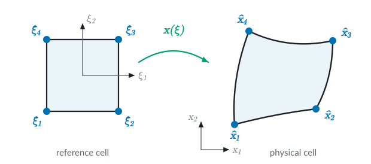
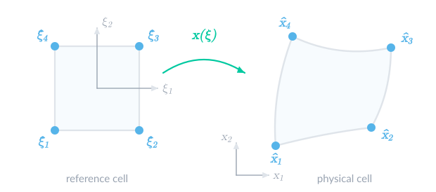

# [FEValues](@id fevalues_topicguide)
A key type of object in Ferrite is the so-called `FEValues`, where the most common ones are `CellValues` and `FacetValues`. These objects are used inside the element routines and are used to query the integration weights, shape function values and gradients, and much more; see [`CellValues`](@ref),
[`MultiFieldCellValues`](@ref), and [`FacetValues`](@ref). For these values to be correct, it is necessary to reinitialize these for the current cell by using the [`reinit!`](@ref) function. This function maps the values from the reference cell to the actual cell, a process described in detail below, see [Mapping of finite elements](@ref mapping_theory). After that, we show an implementation of a [`SimpleCellValues`](@ref SimpleCellValues) type to illustrate how `CellValues` work for the most standard case, excluding the generalizations and optimization that complicates the actual code.

## [Mapping of finite elements](@id mapping_theory)
The shape functions and gradients stored in an `FEValues` object, are reinitialized for each cell by calling the `reinit!` function.
The main part of this calculation, considers how to map the values and derivatives of the shape functions,
defined on the reference cell, to the actual cell.

The geometric mapping of a finite element from the reference coordinates to the real coordinates is shown in the following illustration.




Here, $\xi_i$ is reference coordinate $i$ and $x_i$ the corresponding real coordinate, while
$\hat{\boldsymbol{\xi}}_\alpha$ and $\hat{\boldsymbol{x}}_\alpha$ are the reference and real
positions of node $\alpha$.

This mapping is given by the geometric shape functions, $\hat{N}_i^g(\boldsymbol{\xi})$, such that
```math
\begin{align*}
    \boldsymbol{x}(\boldsymbol{\xi}) =& \sum_{\alpha=1}^N \hat{\boldsymbol{x}}_\alpha \hat{N}_\alpha^g(\boldsymbol{\xi}) \\
    \boldsymbol{J} :=& \frac{\mathrm{d}\boldsymbol{x}}{\mathrm{d}\boldsymbol{\xi}} = \sum_{\alpha=1}^N \hat{\boldsymbol{x}}_\alpha \otimes \frac{\mathrm{d} \hat{N}_\alpha^g}{\mathrm{d}\boldsymbol{\xi}}\\
    \boldsymbol{\mathcal{H}} :=&
    \frac{\mathrm{d} \boldsymbol{J}}{\mathrm{d} \boldsymbol{\xi}} = \sum_{\alpha=1}^N \hat{\boldsymbol{x}}_\alpha \otimes \frac{\mathrm{d}^2 \hat{N}^g_\alpha}{\mathrm{d} \boldsymbol{\xi}^2}
\end{align*}
```
where the defined $\boldsymbol{J}$ is the jacobian of the mapping, and in some cases we will also need the corresponding hessian, $\boldsymbol{\mathcal{H}}$ (3rd order tensor).

We require that the mapping from reference coordinates to real coordinates is [diffeomorphic](https://en.wikipedia.org/wiki/Diffeomorphism), meaning that we can express $\boldsymbol{x} = \boldsymbol{x}(\boldsymbol{\xi}(\boldsymbol{x}))$, such that
```math
\begin{align*}
    \frac{\mathrm{d}\boldsymbol{x}}{\mathrm{d}\boldsymbol{x}} = \boldsymbol{I} &= \frac{\mathrm{d}\boldsymbol{x}}{\mathrm{d}\boldsymbol{\xi}} \cdot \frac{\mathrm{d}\boldsymbol{\xi}}{\mathrm{d}\boldsymbol{x}}
    \quad\Rightarrow\quad
    \frac{\mathrm{d}\boldsymbol{\xi}}{\mathrm{d}\boldsymbol{x}} = \left[\frac{\mathrm{d}\boldsymbol{x}}{\mathrm{d}\boldsymbol{\xi}}\right]^{-1} = \boldsymbol{J}^{-1}
\end{align*}
```
Depending on the function interpolation, we may want different types of mappings to conserve certain properties of the fields. This results in the different mapping types described below.

### Identity mapping
`Ferrite.IdentityMapping`

For scalar fields, we always use scalar base functions. For tensorial fields (non-scalar, e.g. vector-fields), the base functions can be constructed from scalar base functions, by using e.g. `VectorizedInterpolation`. From the perspective of the mapping, however, each component is mapped as an individual scalar base function. And for scalar base functions, we only require that the value of the base function is invariant to the element shape (real coordinate), and only depends on the reference coordinate, i.e.
```math
\begin{align*}
    N(\boldsymbol{x}) &= \hat{N}(\boldsymbol{\xi}(\boldsymbol{x}))\nonumber \\
    \mathrm{grad}(N(\boldsymbol{x})) &= \frac{\mathrm{d}\hat{N}}{\mathrm{d}\boldsymbol{\xi}} \cdot \boldsymbol{J}^{-1}
\end{align*}
```

Second order gradients of the shape functions are computed as

```math
\begin{align*}
    \mathrm{grad}(\mathrm{grad}(N(\boldsymbol{x}))) = \frac{\mathrm{d}^2 N}{\mathrm{d}\boldsymbol{x}^2} = \boldsymbol{J}^{-T} \cdot \left[\frac{\mathrm{d}^2\hat{N}}{\mathrm{d}\boldsymbol{\xi}^2} -  \mathrm{grad}(N) \cdot \boldsymbol{\mathcal{H}} \right]  \cdot \boldsymbol{J}^{-1}
\end{align*}
```
!!! details "Derivation"
    The gradient of the shape functions is obtained using the chain rule:
    ```math
    \begin{align*}
        \frac{\mathrm{d} N}{\mathrm{d}x_i} = \frac{\mathrm{d} \hat N}{\mathrm{d} \xi_r}\frac{\mathrm{d} \xi_r}{\mathrm{d} x_i} = \frac{\mathrm{d} \hat N}{\mathrm{d} \xi_r} J^{-1}_{ri}
    \end{align*}
    ```

    For the second order gradients, we first use the product rule on the equation above:

    ```math
    \begin{align}
        \frac{\mathrm{d}^2 N}{\mathrm{d}x_i \mathrm{d}x_j} = \frac{\mathrm{d}}{\mathrm{d}x_j}\left[\frac{\mathrm{d} \hat N}{\mathrm{d}   \xi_r}\right] J^{-1}_{ri} + \frac{\mathrm{d} \hat N}{\mathrm{d} \xi_r} \frac{\mathrm{d}J^{-1}_{ri}}{\mathrm{d}x_j}
    \end{align}
    ```

    Using the fact that $\frac{\mathrm{d}\hat{f}(\boldsymbol{\xi})}{\mathrm{d}x_j} = \frac{\mathrm{d}\hat{f}(\boldsymbol{\xi})}{\mathrm{d}\xi_s} J^{-1}_{sj}$, the first term in the equation above can be expressed as:

    ```math
    \begin{align*}
        \frac{\mathrm{d}}{\mathrm{d}x_j}\left[\frac{\mathrm{d} \hat N}{\mathrm{d} \xi_r}\right] J^{-1}_{ri} = J^{-1}_{sj}\frac{\mathrm{d}}{\mathrm{d}\xi_s}\left[\frac{\mathrm{d} \hat N}{\mathrm{d} \xi_r}\right] J^{-1}_{ri} = J^{-1}_{sj}\left[\frac{\mathrm{d}^2 \hat N}{\mathrm{d} \xi_s\mathrm{d} \xi_r}\right] J^{-1}_{ri}
    \end{align*}
    ```

    The second term can be written as:

    ```math
    \begin{align*}
        \frac{\mathrm{d} \hat N}{\mathrm{d} \xi_r}\frac{\mathrm{d}J^{-1}_{ri}}{\mathrm{d}x_j} = \frac{\mathrm{d} \hat N}{\mathrm{d} \xi_r}\left[\frac{\mathrm{d}J^{-1}_{ri}}{\mathrm{d}\xi_s}\right]J^{-1}_{sj} = \frac{\mathrm{d} \hat N}{\mathrm{d} \xi_r}\left[- J^{-1}_{rk}\mathcal{H}_{kps} J^{-1}_{pi}\right] J^{-1}_{sj} = - \frac{\mathrm{d} \hat N}{\mathrm{d} x_k}\mathcal{H}_{kps} J^{-1}_{pi}J^{-1}_{sj}
    \end{align*}
    ```

    where we have used that the inverse of the jacobian can be computed as:

    ```math
    \begin{align*}
    0 = \frac{\mathrm{d}}{\mathrm{d}\xi_s} (J_{kr} J^{-1}_{ri} ) = \frac{\mathrm{d}J_{kp}}{\mathrm{d}\xi_s} J^{-1}_{pi}  + J_{kr} \frac{\mathrm{d}J^{-1}_{ri}}{\mathrm{d}\xi_s} = 0 \quad \Rightarrow \\
    \end{align*}
    ```

    ```math
    \begin{align*}
    \frac{\mathrm{d}J^{-1}_{ri}}{\mathrm{d}\xi_s} = - J^{-1}_{rk}\frac{\mathrm{d}J_{kp}}{\mathrm{d}\xi_s} J^{-1}_{pi} = - J^{-1}_{rk}\mathcal{H}_{kps} J^{-1}_{pi}\\
    \end{align*}
    ```

#### Local frame derivatives for identity mapping
Ferrite can also compute derivatives wrt. coordinates in different frames. This is useful for some element formulations,
e.g. shells, plates, and beams, where it is more natural to work with derivatives wrt. coordinates in a local orthonormal
frame attached to the element, rather than wrt. the global coordinates, $\boldsymbol{x}$.

**The local frame.** In each quadrature point, $\boldsymbol{x}_q = \boldsymbol{x}(\boldsymbol{\xi}_q)$,
we can assign a local frame: $\boldsymbol{E} = [\boldsymbol{e}_1, \dots, \boldsymbol{e}_{r_\mathrm{dim}}]$ ($s_\mathrm{dim} \times r_\mathrm{dim}$).
Currently, the local frame is obtained via Gram-Schmidt orthonormalization of the columns,
$\boldsymbol{j}_r = \partial \boldsymbol{x} / \partial \xi_r$, of the jacobian:
```math
\begin{align*}
    \boldsymbol{e}_1 = \frac{\boldsymbol{j}_1}{\Vert \boldsymbol{j}_1 \Vert}, \qquad
    \boldsymbol{e}_2 = \frac{\boldsymbol{j}_2 - (\boldsymbol{e}_1 \cdot \boldsymbol{j}_2)\boldsymbol{e}_1}{\Vert \boldsymbol{j}_2 - (\boldsymbol{e}_1 \cdot \boldsymbol{j}_2)\boldsymbol{e}_1 \Vert}, \qquad
    \boldsymbol{e}_3 = \frac{\boldsymbol{j}_3 - (\boldsymbol{e}_1 \cdot \boldsymbol{j}_3)\boldsymbol{e}_1 - (\boldsymbol{e}_2 \cdot \boldsymbol{j}_3)\boldsymbol{e}_2}{\Vert \cdots \Vert}
\end{align*}
```
Hence, $\boldsymbol{e}_1$ is aligned with the $\xi_1$-direction of the element, and
$\boldsymbol{E}^\mathrm{T} \cdot \boldsymbol{E} = \boldsymbol{I}$. The frame spans the same space as the columns of $\boldsymbol{J}$,
i.e. the tangent space for embedded elements, and for non-embedded elements $\boldsymbol{E}$ is a rotation.

**The local coordinates.** The frame is *frozen* at the quadrature point, and the local coordinates are
defined as the (Cartesian) coordinates in this frame, i.e. the projection onto the tangent space at $\boldsymbol{x}_q$,
```math
\begin{align*}
    \boldsymbol{s}(\boldsymbol{\xi}) = \boldsymbol{E}^\mathrm{T} \cdot \left[\boldsymbol{x}(\boldsymbol{\xi}) - \boldsymbol{x}_q\right]
\end{align*}
```
This gives the $r_\mathrm{dim} \times r_\mathrm{dim}$ jacobian and the corresponding hessian of the mapping from $\boldsymbol{\xi}$ to $\boldsymbol{s}$,
```math
\begin{align*}
    \boldsymbol{B} := \frac{\mathrm{d}\boldsymbol{s}}{\mathrm{d}\boldsymbol{\xi}} = \boldsymbol{E}^\mathrm{T} \cdot \boldsymbol{J}, \qquad
    \boldsymbol{\mathcal{H}}_s := \frac{\mathrm{d}^2\boldsymbol{s}}{\mathrm{d}\boldsymbol{\xi}^2} = \boldsymbol{E}^\mathrm{T} \cdot \boldsymbol{\mathcal{H}}
\end{align*}
```
where $\boldsymbol{B}$ is always invertible for a non-degenerate element.

**The local derivatives.** As for the identity mapping above, the shape functions are invariant, $N(\boldsymbol{s}) = \hat{N}(\boldsymbol{\xi}(\boldsymbol{s}))$,
and the local derivatives follow from the same steps as above, but with $\boldsymbol{J}$ and $\boldsymbol{\mathcal{H}}$ replaced by $\boldsymbol{B}$ and $\boldsymbol{\mathcal{H}}_s$:
```math
\begin{align*}
    \frac{\mathrm{d} N}{\mathrm{d}\boldsymbol{s}} &= \frac{\mathrm{d}\hat{N}}{\mathrm{d}\boldsymbol{\xi}} \cdot \boldsymbol{B}^{-1} \\
    \frac{\mathrm{d}^2 N}{\mathrm{d}\boldsymbol{s}^2} &= \boldsymbol{B}^{-\mathrm{T}} \cdot \left[\frac{\mathrm{d}^2\hat{N}}{\mathrm{d}\boldsymbol{\xi}^2} - \frac{\mathrm{d} N}{\mathrm{d}\boldsymbol{s}} \cdot \boldsymbol{\mathcal{H}}_s \right] \cdot \boldsymbol{B}^{-1}
\end{align*}
```
For vectorized interpolations, each component is treated as a scalar shape function, as for the identity mapping above.

**Relation to the global derivatives.** For non-embedded elements, $\boldsymbol{E}$ is a rotation, $\boldsymbol{x} - \boldsymbol{x}_q = \boldsymbol{E} \cdot \boldsymbol{s}$,
and the local derivatives are simply the global derivatives expressed in the rotated frame,
```math
\begin{align*}
    \frac{\mathrm{d} N}{\mathrm{d}\boldsymbol{s}} = \mathrm{grad}(N) \cdot \boldsymbol{E}, \qquad
    \frac{\mathrm{d}^2 N}{\mathrm{d}\boldsymbol{s}^2} = \boldsymbol{E}^\mathrm{T} \cdot \mathrm{grad}(\mathrm{grad}(N)) \cdot \boldsymbol{E}
\end{align*}
```
For embedded elements, the local gradient contains the components of the tangential gradient in the local frame,
$\mathrm{d} N / \mathrm{d}\boldsymbol{s} = \mathrm{grad}(N) \cdot \boldsymbol{E}$, and $\mathrm{grad}(N) = \mathrm{d} N / \mathrm{d}\boldsymbol{s} \cdot \boldsymbol{E}^\mathrm{T}$.

!!! note "Frozen frame"
    Since the frame is frozen at the quadrature point, the variation of $\boldsymbol{E}$ over the element does not
    enter the local derivatives, and the local hessian is the hessian wrt. the Cartesian coordinates in the
    tangent space at $\boldsymbol{x}_q$. For curved embedded elements (e.g. curved shells), only the tangential part,
    $\boldsymbol{E}^\mathrm{T} \cdot \boldsymbol{\mathcal{H}}$, of the geometric hessian enters, while the curvature of the element
    (the normal part of $\boldsymbol{\mathcal{H}}$) does not.

!!! details "Derivation"
    In index notation, with $a, b, c$ denoting local coordinate indices, $r, t$ reference coordinate indices,
    and $i$ spatial coordinate indices, the mapping from reference to local coordinates and its derivatives are
    ```math
    \begin{align*}
        s_a(\boldsymbol{\xi}) = E_{ia}\left[x_i(\boldsymbol{\xi}) - x_{q,i}\right], \qquad
        \frac{\mathrm{d} s_a}{\mathrm{d} \xi_r} = E_{ia} J_{ir} = B_{ar}, \qquad
        \frac{\mathrm{d}^2 s_a}{\mathrm{d} \xi_r \mathrm{d} \xi_t} = E_{ia} \mathcal{H}_{irt} = \mathcal{H}_{s,art}
    \end{align*}
    ```
    where $\boldsymbol{E}$ is constant, since it is frozen at $\boldsymbol{x}_q$.
    Instead of inverting the mapping as for the identity mapping above, we can differentiate
    $\hat{N}(\boldsymbol{\xi}) = N(\boldsymbol{s}(\boldsymbol{\xi}))$ wrt. $\boldsymbol{\xi}$ with the chain rule:
    ```math
    \begin{align*}
        \frac{\mathrm{d} \hat{N}}{\mathrm{d} \xi_r} = \frac{\mathrm{d} N}{\mathrm{d} s_a} B_{ar}
        \quad\Rightarrow\quad
        \frac{\mathrm{d} N}{\mathrm{d} s_a} = \frac{\mathrm{d} \hat{N}}{\mathrm{d} \xi_r} B^{-1}_{ra}
    \end{align*}
    ```
    Differentiating once more, using the product rule and that $\mathrm{d}(\mathrm{d} N / \mathrm{d} s_a) / \mathrm{d} \xi_t = \mathrm{d}^2 N / (\mathrm{d} s_a \mathrm{d} s_b) \, B_{bt}$,
    ```math
    \begin{align*}
        \frac{\mathrm{d}^2 \hat{N}}{\mathrm{d} \xi_r \mathrm{d} \xi_t}
        = \frac{\mathrm{d}^2 N}{\mathrm{d} s_a \mathrm{d} s_b} B_{ar} B_{bt} + \frac{\mathrm{d} N}{\mathrm{d} s_c} \mathcal{H}_{s,crt}
    \end{align*}
    ```
    Multiplying by $B^{-1}_{ra} B^{-1}_{tb}$ and solving for the local hessian gives
    ```math
    \begin{align*}
        \frac{\mathrm{d}^2 N}{\mathrm{d} s_a \mathrm{d} s_b}
        = B^{-1}_{ra} \left[\frac{\mathrm{d}^2 \hat{N}}{\mathrm{d} \xi_r \mathrm{d} \xi_t} - \frac{\mathrm{d} N}{\mathrm{d} s_c} \mathcal{H}_{s,crt}\right] B^{-1}_{tb}
    \end{align*}
    ```

    For the relation to the global gradient of embedded elements, the pseudo-inverse of the jacobian is used,
    $\boldsymbol{J}^{+} = (\boldsymbol{J}^\mathrm{T} \cdot \boldsymbol{J})^{-1} \cdot \boldsymbol{J}^\mathrm{T}$, such that
    $\mathrm{grad}(N) = \mathrm{d}\hat{N}/\mathrm{d}\boldsymbol{\xi} \cdot \boldsymbol{J}^{+}$.
    Inserting $\boldsymbol{J} = \boldsymbol{E} \cdot \boldsymbol{B}$ and using $\boldsymbol{E}^\mathrm{T} \cdot \boldsymbol{E} = \boldsymbol{I}$ gives
    ```math
    \begin{align*}
        \boldsymbol{J}^{+} = (\boldsymbol{B}^\mathrm{T} \cdot \boldsymbol{B})^{-1} \cdot \boldsymbol{B}^\mathrm{T} \cdot \boldsymbol{E}^\mathrm{T} = \boldsymbol{B}^{-1} \cdot \boldsymbol{E}^\mathrm{T}
        \quad\Rightarrow\quad
        \mathrm{grad}(N) \cdot \boldsymbol{E} = \frac{\mathrm{d}\hat{N}}{\mathrm{d}\boldsymbol{\xi}} \cdot \boldsymbol{B}^{-1} = \frac{\mathrm{d} N}{\mathrm{d}\boldsymbol{s}}
    \end{align*}
    ```
    For non-embedded elements, $\boldsymbol{J}^{+} = \boldsymbol{J}^{-1}$ and the same result holds, and since
    $\boldsymbol{x} - \boldsymbol{x}_q = \boldsymbol{E} \cdot \boldsymbol{s}$ is then an affine map, the second derivatives
    transform as $\mathrm{d}^2 N / \mathrm{d}\boldsymbol{s}^2 = \boldsymbol{E}^\mathrm{T} \cdot \mathrm{grad}(\mathrm{grad}(N)) \cdot \boldsymbol{E}$.

### Covariant Piola mapping, H(curl)
`Ferrite.CovariantPiolaMapping`

The covariant Piola mapping of a vectorial base function preserves the tangential components. For the value, the mapping is defined as
```math
\begin{align*}
    \boldsymbol{N}(\boldsymbol{x}) = \boldsymbol{J}^{-\mathrm{T}} \cdot \hat{\boldsymbol{N}}(\boldsymbol{\xi}(\boldsymbol{x}))
\end{align*}
```
which yields the gradient,
```math
\begin{align*}
    \mathrm{grad}(\boldsymbol{N}(\boldsymbol{x})) &= \boldsymbol{J}^{-T} \cdot \frac{\mathrm{d} \hat{\boldsymbol{N}}}{\mathrm{d} \boldsymbol{\xi}} \cdot \boldsymbol{J}^{-1} - \boldsymbol{J}^{-T} \cdot \left[\hat{\boldsymbol{N}}(\boldsymbol{\xi}(\boldsymbol{x}))\cdot \boldsymbol{J}^{-1} \cdot \boldsymbol{\mathcal{H}}\cdot \boldsymbol{J}^{-1}\right]
\end{align*}
```

!!! details "Derivation"
    Expressing the gradient, $\mathrm{grad}(\boldsymbol{N})$, in index notation,
    ```math
    \begin{align*}
        \frac{\mathrm{d} N_i}{\mathrm{d} x_j} &= \frac{\mathrm{d}}{\mathrm{d} x_j} \left[J^{-\mathrm{T}}_{ik} \hat{N}_k\right] = \frac{\mathrm{d} J^{-\mathrm{T}}_{ik}}{\mathrm{d} x_j} \hat{N}_k + J^{-\mathrm{T}}_{ik}  \frac{\mathrm{d} \hat{N}_k}{\mathrm{d} \xi_l} J_{lj}^{-1}
    \end{align*}
    ```

    Except for a few elements, $\boldsymbol{J}$ varies as a function of $\boldsymbol{x}$. The derivative can be calculated as
    ```math
    \begin{align*}
        \frac{\mathrm{d} J^{-\mathrm{T}}_{ik}}{\mathrm{d} x_j} &= \frac{\mathrm{d} J^{-\mathrm{T}}_{ik}}{\mathrm{d} J_{mn}} \frac{\mathrm{d} J_{mn}}{\mathrm{d} x_j} = - J_{km}^{-1} J_{in}^{-T} \frac{\mathrm{d} J_{mn}}{\mathrm{d} x_j} \nonumber \\
        \frac{\mathrm{d} J_{mn}}{\mathrm{d} x_j} &= \mathcal{H}_{mno} J_{oj}^{-1}
    \end{align*}
    ```

### Contravariant Piola mapping, H(div)
`Ferrite.ContravariantPiolaMapping`

The contravariant Piola mapping of a vectorial base function preserves the normal components. For the value, the mapping is defined as
```math
\begin{align*}
    \boldsymbol{N}(\boldsymbol{x}) = \frac{\boldsymbol{J}}{\det(\boldsymbol{J})} \cdot \hat{\boldsymbol{N}}(\boldsymbol{\xi}(\boldsymbol{x}))
\end{align*}
```
This gives the gradient
```math
\begin{align*}
    \mathrm{grad}(\boldsymbol{N}(\boldsymbol{x})) = [\boldsymbol{\mathcal{H}}\cdot\boldsymbol{J}^{-1}] : \frac{[\boldsymbol{I} \underline{\otimes} \boldsymbol{I}] \cdot \hat{\boldsymbol{N}}}{\det(\boldsymbol{J})}
    - \left[\frac{\boldsymbol{J} \cdot \hat{\boldsymbol{N}}}{\det(\boldsymbol{J})}\right] \otimes \left[\boldsymbol{J}^{-T} : \boldsymbol{\mathcal{H}} \cdot \boldsymbol{J}^{-1}\right]
    + \boldsymbol{J} \cdot \frac{\mathrm{d} \hat{\boldsymbol{N}}}{\mathrm{d} \boldsymbol{\xi}} \cdot \frac{\boldsymbol{J}^{-1}}{\det(\boldsymbol{J})}
\end{align*}
```

!!! details "Derivation"
    Expressing the gradient, $\mathrm{grad}(\boldsymbol{N})$, in index notation,
    ```math
    \begin{align*}
        \frac{\mathrm{d} N_i}{\mathrm{d} x_j} &= \frac{\mathrm{d}}{\mathrm{d} x_j} \left[\frac{J_{ik}}{\det(\boldsymbol{J})} \hat{N}_k\right] =\nonumber\\
        &= \frac{\mathrm{d} J_{ik}}{\mathrm{d} x_j} \frac{\hat{N}_k}{\det(\boldsymbol{J})}
        - \frac{\mathrm{d} \det(\boldsymbol{J})}{\mathrm{d} x_j} \frac{J_{ik} \hat{N}_k}{\det(\boldsymbol{J})^2}
        + \frac{J_{ik}}{\det(\boldsymbol{J})}  \frac{\mathrm{d} \hat{N}_k}{\mathrm{d} \xi_l} J_{lj}^{-1} \\
        &= \mathcal{H}_{ikl} J^{-1}_{lj} \frac{\hat{N}_k}{\det(\boldsymbol{J})}
        - J^{-T}_{mn} \mathcal{H}_{mnl} J^{-1}_{lj} \frac{J_{ik} \hat{N}_k}{\det(\boldsymbol{J})}
        + \frac{J_{ik}}{\det(\boldsymbol{J})}  \frac{\mathrm{d} \hat{N}_k}{\mathrm{d} \xi_l} J_{lj}^{-1}
    \end{align*}
    ```

## [Walkthrough: Creating `SimpleCellValues`](@id SimpleCellValues)
In the following, we walk through how to create a `SimpleCellValues` type which
works similar to Ferrite's `CellValues`, but is not performance optimized and not as general. The main purpose is to explain how the `CellValues` works for the standard case of `IdentityMapping` described above.
Please note that several internal functions are used, and these may change without a major version increment. Please see the [Developer documentation](@ref) for their documentation.

```@eval
# Include the example here, but modify the Literate output to suit being embedded
using Literate, Markdown
base_name = "SimpleCellValues_literate"
Literate.markdown(string(base_name, ".jl"); name = base_name, execute = true, credit = false, documenter=false)
content = read(string(base_name, ".md"), String)
rm(string(base_name, ".md"))
rm(string(base_name, ".jl"))
Markdown.parse(content)
```

## Further reading
* [defelement.org](https://defelement.org/ciarlet.html#Mapping+finite+elements)
* Kirby (2017) [Kirby2017](@cite)
