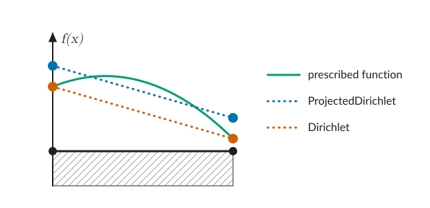
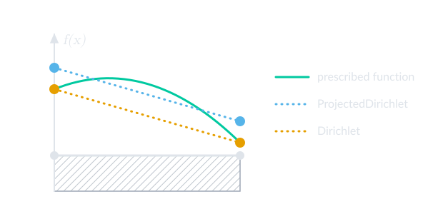

```@meta
DocTestSetup = :(using Ferrite)
```

# Boundary and initial conditions

Every PDE is accompanied with boundary conditions. There are different types of boundary
conditions, and they need to be handled in different ways. Below we discuss how to handle
the most common ones, Dirichlet, Neumann, and Robin boundary conditions, and how to do it in
Ferrite.

While boundary conditions can be applied directly to nodes, vertices, edges, or faces,
they are most commonly applied to [facets](@ref "Reference shapes"). Each facet is described
by a [`FacetIndex`](@ref).
When adding boundary conditions to points instead, vertices are preferred over nodes.

```@contents
Pages = ["boundary_conditions.md"]
Depth = 2:2
```

## Dirichlet boundary conditions

At a Dirichlet boundary the unknown field is prescribed to a given value. For the discrete
FE-solution this means that there are some degrees of freedom that are fixed. To handle
Dirichlet boundary conditions in Ferrite we use the [`ConstraintHandler`](@ref). A
constraint handler is created from a DoF handler:

```@setup dirichlet
using Ferrite
grid = generate_grid(Hexahedron, (2, 2, 2))
dh = DofHandler(grid)
add!(dh, :u, Lagrange{RefHexahedron, 1}())
add!(dh, :v, Lagrange{RefHexahedron, 1}()^3)
close!(dh)
```

```@example dirichlet
ch = ConstraintHandler(dh)
nothing # hide
```

We can now create Dirichlet constraints and add them to the constraint handler. To create a
Dirichlet constraint we need to specify a field name, a part of the boundary, and a function
for computing the prescribed value. Example:

```@example dirichlet
dbc1 = Dirichlet(
    :u,                        # Name of the field
    getfacetset(grid, "left"), # Part of the boundary
    x -> 1.0,                  # Function mapping coordinate to a prescribed value
)
nothing # hide
```

The field name is given as a symbol, just like when the field was added to the dof handler,
the part of the boundary where this constraint is active is given as a facet set, and the
function computing the prescribed value should be of the form `f(x)` or `f(x, t)`
(coordinate `x` and time `t`) and return the prescribed value(s).

!!! note "Multiple sets"
    To apply a constraint on multiple facet sets in the grid you can use `union` to join
    them, for example
    ```@example dirichlet
    left_right = union(getfacetset(grid, "left"), getfacetset(grid, "right"))
    @assert length(left_right) == 8 # hide
    nothing # hide
    ```
    creates a new facetset containing all facets in the `"left"` and "`right`" facetsets,
    which can be passed to the `Dirichlet` constructor.

By default the constraint is added to all components of the given field. To add the
constraint to selected components a fourth argument with the components should be passed to
the constructor. Here is an example where a constraint is added to component 1 and 3 of a
vector field `:v`:

```@example dirichlet
dbc2 = Dirichlet(
    :v,                        # Name of the field
    getfacetset(grid, "left"), # Part of the boundary
    x -> [0.0, 0.0],           # Function mapping coordinate to prescribed values
    [1, 3],                    # Components
)
nothing # hide
```

Note that the return value of the function must match with the components -- in the example
above we prescribe components 1 and 3 to 0 so we return a vector of length 2.

Adding the constraints to the constraint handler is done with [`add!`](@ref):

```@example dirichlet
add!(ch, dbc1)
add!(ch, dbc2)
nothing # hide
```

Finally, just like for the dof handler, we need to use [`close!`](@ref) to finalize the
constraint handler. Internally this will then compute the degrees-of-freedom that match the
constraints we added.

```@example dirichlet
close!(ch)
@assert length(ch.prescribed_dofs) == 9 + 2 * 9 # hide
nothing # hide
```

If one or more of the constraints depend on time, i.e. they are specified as `f(x, t)`, the
prescribed values can be recomputed in each new time step by calling [`update!`](@ref) with
the proper time, e.g.:

```@example dirichlet
for t in 0.0:0.1:1.0
    update!(ch, t) # Compute prescribed values for this t
    # Solve for time t...
end
```

!!! note "Examples"
    Most examples make use of Dirichlet boundary conditions, for example [Heat
    Equation](@ref tutorial-heat-equation).

### Projected Dirichlet boundary conditions
Some interpolations don't have nodal support points:
``H(\mathrm{curl})`` interpolations, e.g., `Nedelec`, are associated to edges and faces,
while ``H(\mathrm{div})`` interpolations, e.g. `RaviartThomas`, are associated to facets.
While normal `Dirichlet` boundary conditions assume the existence of such nodal support points,
Ferrite provides the `ProjectedDirichlet`, which instead finds the degree of freedom values that
minimizes the L2-distance between the prescribed function, ``f(\boldsymbol{x},t,\boldsymbol{n})``,
and the finite element interpolation space, cf. [Bartels2004:ProjectedDirichlet](@cite).
Although standard interpolations are not currently supported,
the figure below illustrates well the difference between applying a standard `Dirichlet` condition and a
`ProjectedDirichlet` condition when the prescribed function cannot be described by the chosen FE-interpolation.




Here, we note that while the `Dirichlet` condition gives the correct value at the nodes, the `ProjectedDirichlet` gives
a more accurate average boundary value (specifically the L2 projection of `f(x)` onto the finite element space).

## Neumann boundary conditions
At the Neumann part of the boundary we know something about the gradient of the solution.
Two different methods for applying these are described below.
For complete examples that use Neumann boundary conditions, please see
- [von-Mises-plasticity](@ref tutorial-plasticity)
- [Hyperelasticity](@ref tutorial-hyperelasticity)

### Using the `FacetIterator`
A Neumann boundary contribution can be added by iterating over
the relevant `facetset` by using the [`FacetIterator`](@ref).
For a scalar field, this can be done as

```@example neumann
using Ferrite # hide
grid = generate_grid(Quadrilateral, (3, 3))
dh = DofHandler(grid); add!(dh, :u, Lagrange{RefQuadrilateral, 1}()); close!(dh)
fv = FacetValues(FacetQuadratureRule{RefQuadrilateral}(2), Lagrange{RefQuadrilateral, 1}())
f = zeros(ndofs(dh))
fe = zeros(ndofs_per_cell(dh))
qn = 1.0    # Outward normal flux, q ⋅ n (heat leaving the domain)
for fc in FacetIterator(dh, getfacetset(grid, "right"))
    reinit!(fv, fc)
    fill!(fe, 0)
    for q_point in 1:getnquadpoints(fv)
        dΓ = getdetJdV(fv, q_point)
        for i in 1:getnbasefunctions(fv)
            δu = shape_value(fv, q_point, i)
            fe[i] -= δu * qn * dΓ
        end
    end
    assemble!(f, celldofs(fc), fe)
end
@assert sum(f) ≈ -2 * qn # hide
nothing # hide
```

Alternatively, it is possible to add the values directly to the global `f` (without going
through the local `fe` vector and then using `assemble!`):
```@example neumann
f_fe = copy(f) # hide
fill!(f, 0) # hide
for fc in FacetIterator(dh, getfacetset(grid, "right"))
    reinit!(fv, fc)
    dofs = celldofs(fc)
    for q_point in 1:getnquadpoints(fv)
        dΓ = getdetJdV(fv, q_point)
        for i in 1:getnbasefunctions(fv)
            δu = shape_value(fv, q_point, i)
            f[dofs[i]] -= δu * qn * dΓ
        end
    end
end
@assert f ≈ f_fe # hide
nothing # hide
```

### In the element routine
Alternatively, the boundary integral can be evaluated in the element routine, together
with the contributions from the domain integrals:

```@example neumann
function assemble_element!(Ke, fe, cell, facetvalues, ΓN, qn)
    # ... contributions from the domain integrals to Ke and fe ...

    # Contributions from the Neumann boundary
    for facet in 1:nfacets(cell)
        if (cellid(cell), facet) ∈ ΓN
            reinit!(facetvalues, cell, facet)
            for q_point in 1:getnquadpoints(facetvalues)
                dΓ = getdetJdV(facetvalues, q_point)
                for i in 1:getnbasefunctions(facetvalues)
                    δu = shape_value(facetvalues, q_point, i)
                    fe[i] -= δu * qn * dΓ
                end
            end
        end
    end
    return
end
nothing # hide
```

In the element routine we loop over all the facets of the cell, and check if this particular
facet is located on the Neumann boundary, given by the facetset `ΓN`. If we have determined
that the current facet is indeed on the boundary and in our facetset, then we
reinitialize `FacetValues` for this facet, using [`reinit!`](@ref). When `reinit!`ing
`FacetValues` we also need to give the facet number in addition to the cell.
Next we simply loop over the quadrature points of the facet, and then loop over
all the test functions and add the contribution to the element force vector.

The element routine is then called in the loop over the cells, where the facetset is
fetched from the grid once before the loop:

```@example neumann
addfacetset!(grid, "Neumann Boundary", x -> x[1] ≈ 1.0) # hide
facetvalues = fv # hide
K = allocate_matrix(dh) # hide
Ke = zeros(ndofs_per_cell(dh), ndofs_per_cell(dh)) # hide
assembler = start_assemble(K, f) # hide
ΓN = getfacetset(grid, "Neumann Boundary")
for cell in CellIterator(dh)
    fill!(Ke, 0)
    fill!(fe, 0)
    assemble_element!(Ke, fe, cell, facetvalues, ΓN, qn)
    assemble!(assembler, celldofs(cell), Ke, fe)
end
@assert f ≈ f_fe # hide
nothing # hide
```

## Robin boundary conditions

At a Robin boundary a linear combination of the unknown field and its normal flux is
prescribed. Consider, for example, the heat equation

```math
\begin{aligned}
\boldsymbol{\nabla} \cdot \boldsymbol{q} &= f \quad &\forall\, \boldsymbol{x} \in \Omega, \\
u &= g_\mathrm{D} \quad &\forall\, \boldsymbol{x} \in \Gamma_\mathrm{D}, \\
a\, u + b\, q_\mathrm{n} &= g_\mathrm{R} \quad &\forall\, \boldsymbol{x} \in \Gamma_\mathrm{R},
\end{aligned}
```

where ``u`` is the temperature, ``\boldsymbol{q} = -k \boldsymbol{\nabla} u`` the heat flux,
``q_\mathrm{n} := \boldsymbol{q} \cdot \boldsymbol{n}`` the outward normal flux, and ``a``,
``b`` and ``g_\mathrm{R}`` are given. For simplicity the boundary is split into a Dirichlet
and a Robin part, ``\Gamma = \Gamma_\mathrm{D} \cup \Gamma_\mathrm{R}``. Dirichlet (``b = 0``) and Neumann (``a = 0``) boundary
conditions are special cases. Unlike Dirichlet boundary conditions, Robin boundary
conditions are not imposed with the `ConstraintHandler`. Instead they are added weakly, as
boundary integrals, just like Neumann boundary conditions.

Multiplying with a test function ``\delta u``, integrating over the domain, and using
partial integration gives

```math
\int_\Omega k\, \boldsymbol{\nabla} \delta u \cdot \boldsymbol{\nabla} u\, \mathrm{d}\Omega
+ \int_{\Gamma_\mathrm{R}} \delta u\, q_\mathrm{n}\, \mathrm{d}\Gamma
= \int_\Omega \delta u\, f\, \mathrm{d}\Omega,
```

where the test function vanishes on ``\Gamma_\mathrm{D}``. Inserting
``q_\mathrm{n} = (g_\mathrm{R} - a\, u) / b`` from the Robin boundary condition we obtain the
weak form: Find ``u \in \mathbb{U}`` s.t.

```math
\int_\Omega k\, \boldsymbol{\nabla} \delta u \cdot \boldsymbol{\nabla} u\, \mathrm{d}\Omega
- \int_{\Gamma_\mathrm{R}} \delta u\, \frac{a}{b}\, u\, \mathrm{d}\Gamma
= \int_\Omega \delta u\, f\, \mathrm{d}\Omega
- \int_{\Gamma_\mathrm{R}} \delta u\, \frac{g_\mathrm{R}}{b}\, \mathrm{d}\Gamma
\quad \forall\, \delta u \in \mathbb{U}^0.
```

Compared to a Neumann boundary condition, which only contributes to the right hand side,
the Robin boundary condition also contributes to the left hand side, since the boundary
integral depends on the unknown ``u``. After discretization this gives the contributions

```math
K_{ij} \mathrel{+}= -\int_{\Gamma_\mathrm{R}} \phi_i\, \frac{a}{b}\, \phi_j\, \mathrm{d}\Gamma,
\quad
f_i \mathrel{+}= -\int_{\Gamma_\mathrm{R}} \phi_i\, \frac{g_\mathrm{R}}{b}\, \mathrm{d}\Gamma
```

to the stiffness matrix and the right hand side, respectively.

A common way to write the Robin boundary condition for heat transfer is

```math
q_\mathrm{n} = k_\Gamma\, (u - u_\Gamma),
```

where ``k_\Gamma`` is the heat transfer coefficient and ``u_\Gamma`` the ambient
temperature, i.e. heat flows out of the domain when it is warmer than its surroundings. This
corresponds to ``a = -k_\Gamma``, ``b = 1``, and ``g_\mathrm{R} = -k_\Gamma u_\Gamma``, and
the weak form becomes

```math
\int_\Omega k\, \boldsymbol{\nabla} \delta u \cdot \boldsymbol{\nabla} u\, \mathrm{d}\Omega
+ \int_{\Gamma_\mathrm{R}} \delta u\, k_\Gamma\, u\, \mathrm{d}\Gamma
= \int_\Omega \delta u\, f\, \mathrm{d}\Omega
+ \int_{\Gamma_\mathrm{R}} \delta u\, k_\Gamma\, u_\Gamma\, \mathrm{d}\Gamma.
```

For the problem to be well-posed we need ``k_\Gamma \geq 0`` (``a / b \leq 0`` in the general
form).

The Robin contributions can be computed by iterating over the Robin part of the boundary
with the [`FacetIterator`](@ref), similar to Neumann boundary conditions. Since they
contribute to both the stiffness matrix and the right hand side, we assemble them with an
assembler. Here we assume that `K` and `f` already contain the contributions from the domain
integrals, so we pass `fillzero = false` to [`start_assemble`](@ref) to keep them:

```@setup robin
using Ferrite
grid = generate_grid(Quadrilateral, (3, 3))
dh = DofHandler(grid); add!(dh, :u, Lagrange{RefQuadrilateral, 1}()); close!(dh)
# Domain contributions for k = 1 and f = 0
cv = CellValues(QuadratureRule{RefQuadrilateral}(2), Lagrange{RefQuadrilateral, 1}())
K = allocate_matrix(dh)
f = zeros(ndofs(dh))
let assembler = start_assemble(K, f), Ke = zeros(ndofs_per_cell(dh), ndofs_per_cell(dh))
    for cell in CellIterator(dh)
        reinit!(cv, cell)
        fill!(Ke, 0)
        for q_point in 1:getnquadpoints(cv)
            dΩ = getdetJdV(cv, q_point)
            for i in 1:getnbasefunctions(cv), j in 1:getnbasefunctions(cv)
                Ke[i, j] += shape_gradient(cv, q_point, i) ⋅ shape_gradient(cv, q_point, j) * dΩ
            end
        end
        assemble!(assembler, celldofs(cell), Ke)
    end
end
```

```@example robin
fv = FacetValues(FacetQuadratureRule{RefQuadrilateral}(2), Lagrange{RefQuadrilateral, 1}())
kΓ = 2.0    # Heat transfer coefficient
uΓ = 1.0    # Ambient temperature
Ke = zeros(ndofs_per_cell(dh), ndofs_per_cell(dh))
fe = zeros(ndofs_per_cell(dh))
assembler = start_assemble(K, f; fillzero = false)
for fc in FacetIterator(dh, getfacetset(grid, "right"))
    reinit!(fv, fc)
    fill!(Ke, 0)
    fill!(fe, 0)
    for q_point in 1:getnquadpoints(fv)
        dΓ = getdetJdV(fv, q_point)
        for i in 1:getnbasefunctions(fv)
            δu = shape_value(fv, q_point, i)
            fe[i] += δu * kΓ * uΓ * dΓ
            for j in 1:getnbasefunctions(fv)
                u = shape_value(fv, q_point, j)
                Ke[i, j] += δu * kΓ * u * dΓ
            end
        end
    end
    assemble!(assembler, celldofs(fc), Ke, fe)
end
# Check against the analytical solution for u = 0 on the left boundary: # hide
# u(x) = c (x₁ + 1) with c = kΓ uΓ / (1 + 2 kΓ) # hide
ch = ConstraintHandler(dh) # hide
add!(ch, Dirichlet(:u, getfacetset(grid, "left"), x -> 0.0)) # hide
close!(ch) # hide
apply!(K, f, ch) # hide
a = K \ f # hide
c = kΓ * uΓ / (1 + 2kΓ) # hide
@assert evaluate_at_grid_nodes(dh, a, :u) ≈ [c * (n.x[1] + 1) for n in getnodes(grid)] # hide
nothing # hide
```

If ``k_\Gamma`` or ``u_\Gamma`` vary along the boundary, they can be evaluated at the
quadrature point coordinate, given by
`spatial_coordinate(fv, q_point, getcoordinates(fc))`. As for Neumann boundary conditions,
the contributions can also be computed in the element routine instead, by adding the facet
loop to the computation of `Ke` and `fe` for each cell.

## Periodic boundary conditions

Periodic boundary conditions ensure that the solution is periodic across two boundaries. To
define the periodicity we first define the image boundary ``\Gamma^+`` and the mirror
boundary ``\Gamma^-``. We also define a (unique) coordinate mapping between the image and
the mirror: ``\varphi:\ \Gamma^+\, \rightarrow\, \Gamma^-``. With the mapping we can, for
every coordinate on the image, compute the corresponding coordinate on the mirror:

```math
\boldsymbol{x}^- = \varphi(\boldsymbol{x}^+),\quad \boldsymbol{x}^- \in \Gamma^-,\,
\boldsymbol{x}^+ \in \Gamma^+.
```

We now want to ensure that the solution on the image ``\Gamma^+`` is mirrored on the mirror
``\Gamma^-``. This periodicity constraint can thus be described by

```math
u(\boldsymbol{x}^-) = u(\boldsymbol{x}^+).
```

Sometimes this is written as

```math
\llbracket u \rrbracket = 0,
```

where ``\llbracket \bullet \rrbracket := \bullet(\boldsymbol{x}^+) -
\bullet(\boldsymbol{x}^-)`` is the "jump operator". Thus, this condition ensures that the
jump, or difference, in the solution between the image and mirror boundary is zero --
the solution becomes periodic. For a vector valued problem the periodicity constraint can in
general be written as

```math
\boldsymbol{u}(\boldsymbol{x}^-) = \boldsymbol{R} \cdot \boldsymbol{u}(\boldsymbol{x}^+)
\quad \Leftrightarrow \quad \llbracket \boldsymbol{u} \rrbracket =
\boldsymbol{R} \cdot \boldsymbol{u}(\boldsymbol{x}^+) - \boldsymbol{u}(\boldsymbol{x}^-) =
\boldsymbol{0}
```

where ``\boldsymbol{R}`` is a rotation matrix. If the mapping between mirror and image is
simply a translation (e.g. sides of a cube) this matrix will be the identity matrix.

In Ferrite this type of periodic Dirichlet boundary conditions can be added to the
`ConstraintHandler` by constructing an instance of [`PeriodicDirichlet`](@ref). This is
usually done it two steps. First we compute the mapping between mirror and image facets using
[`collect_periodic_facets`](@ref). Here we specify the mirror set and image sets (the sets
are usually known or can be constructed easily ) and the mapping ``\varphi``. Second we
construct the constraint using the `PeriodicDirichlet` constructor. Here we specify which
components of the function that should be constrained, and the rotation matrix
``\boldsymbol{R}`` (when needed). When adding the constraint to the `ConstraintHandler` the
resulting dof-mapping is computed.

Here is a simple example where periodicity is enforced for components 1 and 2 of the field
`:u` between the mirror boundary set `"left"` and the image boundary set `"right"`. Note
that no rotation matrix is needed here since the mirror and image are parallel, just shifted
in the ``x``-direction (as seen by the mapping `φ`):

```@setup periodic
using Ferrite
grid = generate_grid(Quadrilateral, (2, 2), Vec((0.0, 0.0)), Vec((1.0, 1.0)))
dofhandler = DofHandler(grid)
add!(dofhandler, :u, Lagrange{RefQuadrilateral, 1}()^2)
close!(dofhandler)
```

```@example periodic
# Create a constraint handler from the dof handler
ch = ConstraintHandler(dofhandler)

# Compute the facet mapping
φ(x) = x - Vec{2}((1.0, 0.0))
facet_mapping = collect_periodic_facets(grid, "left", "right", φ)

# Construct the periodic constraint for field :u
pdbc = PeriodicDirichlet(:u, facet_mapping, [1, 2])

# Add the constraint to the constraint handler
add!(ch, pdbc)

# If no more constraints should be added we can close
close!(ch)
@assert length(ch.prescribed_dofs) == 2 * 3 # hide
nothing # hide
```

!!! note
    `PeriodicDirichlet` constraints are imposed in a strong sense, so note that this
    requires a periodic mesh such that it is possible to compute the facet mapping between
    facets on the mirror and boundary.

!!! note "Examples"
    Periodic boundary conditions are used in the following examples [Computational
    homogenization](@ref tutorial-computational-homogenization), [Stokes flow](@ref
    tutorial-stokes-flow).


### Heterogeneous "periodic" constraint

It is also possible to define constraints of the form

```math
\llbracket u \rrbracket = \llbracket f \rrbracket
\quad \Leftrightarrow \quad
u(\boldsymbol{x}^+) - u(\boldsymbol{x}^-) =
f(\boldsymbol{x}^+) - f(\boldsymbol{x}^-),
```

where ``f`` is a prescribed function. Although the constraint in this case is not
technically periodic, `PeriodicDirichlet` can be used for this too. This is done by passing
a function to `PeriodicDirichlet`, similar to `Dirichlet`, which, given the coordinate
``\boldsymbol{x}`` and time `t`, computes the prescribed values of ``f`` on the boundary.

Here is an example of how to implement this type of boundary condition, for a known function
`f`:

```@example periodic
f(x) = Vec((x[1], 2 * x[2])) # hide
pdbc = PeriodicDirichlet(
    :u,
    facet_mapping,
    (x, t) -> f(x),
    [1, 2],
)
ch = ConstraintHandler(dofhandler); add!(ch, pdbc); close!(ch); update!(ch, 0.0) # hide
@assert sort(abs.(ch.inhomogeneities)) ≈ [0, 0, 0, 1, 1, 1] # hide
nothing # hide
```

!!! note
    One application for this type of boundary conditions is multiscale modeling and
    computational homogenization when solving the finite element problem for the subscale.
    In this case the unknown ``u`` is split into a macroscopic part ``u^{\mathrm{M}}`` and a
    microscopic/fluctuation part ``u^\mu``, i.e. ``u = u^{\mathrm{M}} + u^{\mu}``.
    Periodicity is then usually enforced for the fluctuation part, i.e. ``\llbracket u^\mu
    \rrbracket = 0``. The equivalent constraint for ``u`` then becomes ``\llbracket u
    \rrbracket = \llbracket u^{\mathrm{M}} \rrbracket``.

    As an example, consider first order homogenization where the macroscopic part is
    constructed as ``u^{\mathrm{M}} = \bar{u} + \boldsymbol{\nabla} \bar{u} \cdot
    [\boldsymbol{x} - \bar{\boldsymbol{x}}]`` for known ``\bar{u}`` and
    ``\boldsymbol{\nabla} \bar{u}``. This could be implemented as
    ```@example periodic
    ū = Vec((0.0, 0.0)); ∇ū = Tensor{2, 2}((0.1, 0.0, 0.0, 0.1)); x̄ = Vec((0.5, 0.5)) # hide
    pdbc = PeriodicDirichlet(
        :u,
        facet_mapping,
        (x, t) -> ū + ∇ū  ⋅ (x - x̄)
    )
    ch = ConstraintHandler(dofhandler); add!(ch, pdbc); close!(ch); update!(ch, 0.0) # hide
    nothing # hide
    ```

## Initial conditions

When solving time-dependent problems, initial conditions, different from zero, may be required.
For finite element formulations of ODE-type,
i.e. ``\boldsymbol{u}'(t) = \boldsymbol{f}(\boldsymbol{u}(t),t)``,
where ``\boldsymbol{u}(t)`` are the degrees of freedom,
initial conditions can be specified by the [`apply_analytical!`](@ref) function.
For example, specify the initial pressure as a function of the y-coordinate
```@example initial
using Ferrite # hide
ρ = 1000; g = 9.81    # density [kg/m³] and gravity [N/kg]
grid = generate_grid(Quadrilateral, (10, 10))
dh = DofHandler(grid); add!(dh, :u, Lagrange{RefQuadrilateral, 1}()^2); add!(dh, :p, Lagrange{RefQuadrilateral, 1}()); close!(dh)
u = zeros(ndofs(dh))
apply_analytical!(u, dh, :p, x -> ρ * g * x[2])
@assert maximum(u) ≈ ρ * g # hide
nothing # hide
```

See also [Transient heat equation](@ref tutorial-transient-heat-equation) for one example.

!!! note "Consistency"
    `apply_analytical!` does not enforce consistency of the applied solution with the system
    of equations. Some problems, like for example differential-algebraic systems of
    equations (DAEs) need extra care during initialization. We refer to the paper
    ["Consistent Initial Condition Calculation for Differential-Algebraic Systems" by Brown
    et al.](https://dx.doi.org/10.1137/S1064827595289996) for more details on this matter.
