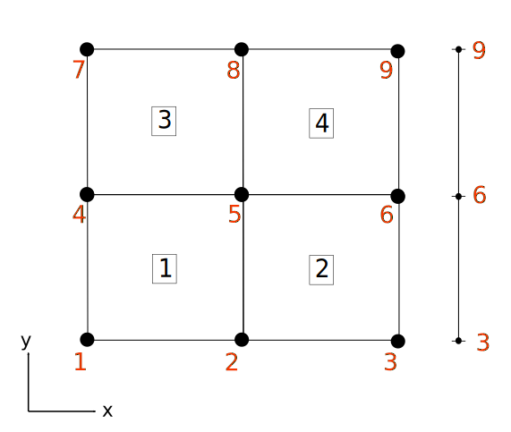

```@meta
DocTestSetup = :(using Ferrite)
```

# Grid

## Mesh Reading

A Ferrite `Grid` can be generated with the [`generate_grid`](@ref) function.
More advanced meshes can be imported with the
[`FerriteMeshParser.jl`](https://github.com/Ferrite-FEM/FerriteMeshParser.jl) (from Abaqus input files),
or even created and translated with the [`Gmsh.jl`](https://github.com/JuliaFEM/Gmsh.jl) and [`FerriteGmsh.jl`](https://github.com/Ferrite-FEM/FerriteGmsh.jl) package, respectively.

### FerriteGmsh

`FerriteGmsh.jl` supports all defined cells with an alias in [`Ferrite.jl`](https://github.com/Ferrite-FEM/Ferrite.jl/blob/master/src/Grid/grid.jl#L39-L54) as well as the 3D Serendipity `Cell{3,20,6}`.
Either, a mesh is created on the fly with the gmsh API or a mesh in `.msh` or `.geo` format can be read and translated with the `FerriteGmsh.togrid` function.
```@docs
FerriteGmsh.togrid
```
`FerriteGmsh.jl` supports currently the translation of `cellsets` and `facetsets`.
Such sets are defined in Gmsh as `PhysicalGroups` of dimension `dim` and `dim-1`, respectively.
In case only a part of the mesh is the domain, the domain can be specified by providing the keyword argument `domain` the name of the `PhysicalGroups` in the [`FerriteGmsh.togrid`](@ref) function.

!!! note "Why you should read a .msh file"
    Reading a `.msh` file is the advertised way, since otherwise you remesh whenever you run the code.
    Further, if you choose to read the grid directly from the current model of the gmsh API you get artificial nodes,
    which doesn't harm the FE computation, but maybe distort your sophisticated grid operations (if present).
    For more information, see [this issue](https://github.com/Ferrite-FEM/FerriteGmsh.jl/issues/20).

If you want to read another, not yet supported cell from gmsh, consider to open a PR at `FerriteGmsh` that extends the [`gmshtoferritecell` dict](https://github.com/Ferrite-FEM/FerriteGmsh.jl/blob/c9de4f64b3ad3c73fcb36758855a6e517c6d0d95/src/FerriteGmsh.jl#L6-L15)
and if needed, reorder the element nodes by dispatching [`FerriteGmsh.translate_elements`](https://github.com/Ferrite-FEM/FerriteGmsh.jl/blob/c9de4f64b3ad3c73fcb36758855a6e517c6d0d95/src/FerriteGmsh.jl#L17-L63).
The reordering of nodes is necessary if the Gmsh ordering doesn't match the one from Ferrite. Gmsh ordering is documented [here](https://gmsh.info/doc/texinfo/gmsh.html#Node-ordering).
For an exemplary usage of `Gmsh.jl` and `FerriteGmsh.jl`, consider the [Stokes flow](@ref tutorial-stokes-flow) and [Incompressible Navier-Stokes Equations via DifferentialEquations.jl](@ref tutorial-ins-ordinarydiffeq) example.

### FerriteMeshParser

`FerriteMeshParser.jl` converts the mesh in an Abaqus input file (`.inp`) to a `Ferrite.Grid` with its function `get_ferrite_grid`.
The translations for most of Abaqus' standard 2d and 3d continuum elements to a `Ferrite.AbstractCell` are defined.
Custom translations can be given as input, which can be used to import other (custom) elements or to override the default translation.
```@docs
FerriteMeshParser.get_ferrite_grid
```

If you are missing the translation of an Abaqus element that is equivalent to a `Ferrite.AbstractCell`,
consider to open an [issue](https://github.com/Ferrite-FEM/FerriteMeshParser.jl/issues/new) or a pull request.

## `Grid` Datastructure

In Ferrite a Grid is a collection of `Node`s and `Cell`s and is parameterized in its physical dimensionality and cell type.
`Node`s are points in the physical space and can be initialized by a N-Tuple, where N corresponds to the dimensions.

```julia
n1 = Node((0.0, 0.0))
```

`Cell`s are defined based on the `Node` IDs. Hence, they collect IDs in a N-Tuple.
Consider the following 2D mesh:



The cells of the grid can be described in the following way

```julia
cells = [Quadrilateral((1, 2, 5, 4)),
         Quadrilateral((2, 3, 6, 5)),
         Quadrilateral((4, 5, 8, 7)),
         Quadrilateral((5, 6, 9, 8))]
```

where each `Quadrilateral <: AbstractCell` is defined by the tuple of node IDs.
Additionally, the data structure `Grid` contains node-, cell-, facet-, and vertexsets.
Each of these sets is defined by a `Dict{String, OrderedSet}`.

Node- and cellsets are represented by an `OrderedSet{Int}`, giving a set of node or cell ID, respectively.

Facet- and vertexsets are represented by `OrderedSet{<:BoundaryIndex}`, where `BoundaryIndex` is a `FacetIndex` or `VertexIndex` respectively.
`FacetIndex` and `VertexIndex` wraps a `Tuple`, `(global_cell_id, local_facet_id)` and `(global_cell_id, local_vertex_id)`, where the local IDs
are defined according to the reference shapes, see [Reference shapes](@ref).

Facetsets are a more elaborate construction. They map a `String` key to a `Set{FaceIndex}`, where each `FaceIndex` consists of `(global_cell_id, local_facet_id)`.
In order to understand the `local_facet_id` properly, one has to consider the reference space of the element, which typically is spanned by a product of the interval ``[-1, 1]`` and in this particular example ``[-1, 1] \times [-1, 1]``.
In this space a local numbering of nodes and facets exists, i.e.


The example shows a local edge ordering, defined as:

```julia
Ferrite.reference_facets(RefQuadrilateral) = ((1,2), (2,3), (3,4), (4,1))
```

Other facet definitions can be found in the src file `src/Grid/grid.jl` in the corresponding dispatches for [`reference_facets`](@ref Ferrite.reference_facets). Furthermorem you can query specific information about subentities via [`reference_vertices`](@ref Ferrite.reference_vertices), [`reference_edges`](@ref Ferrite.reference_edges) and [`reference_faces`](@ref Ferrite.reference_faces).


The highlighted facets, i.e. the two edges from node ID 3 to 6 and from 6 to 9, on the right hand side of our test mesh can now be described as

```julia
julia> boundary_facets = [
           (3,6),
           (6,9)
       ]
```
i.e. by using the node IDs of the reference shape vertices.

The first of these can be found as the 2nd facet of the 2nd cell.
```@repl
using Ferrite #hide
Ferrite.facets(Quadrilateral((2, 3, 6, 5)))
```

The unique representation of an entity is given by the sorted version of this tuple.
While we could use this information to construct a facet set, Ferrite can construct this
set by filtering based on the coordinates, using [`addfacetset!`](@ref).

## AbstractGrid

It can be very useful to use a grid type for a certain special case, e.g. mixed cell types, adaptivity, IGA, etc.
In order to define your own `<: AbstractGrid` you need to fulfill the `AbstractGrid` interface.
In case that certain structures are preserved from the `Ferrite.Grid` type, you don't need to dispatch on your own type, but rather rely on the fallback `AbstractGrid` dispatch.

### Example

As a starting point, we choose a minimal working example from the test suite:

```julia
struct SmallGrid{dim,N,C<:Ferrite.AbstractCell} <: Ferrite.AbstractGrid{dim}
    nodes_test::Vector{NTuple{dim,Float64}}
    cells_test::NTuple{N,C}
end
```

Here, the names of the fields as well as their underlying datastructure changed compared to the `Grid` type. This would lead to the fact, that any usage
with the utility functions and DoF management will not work. So, we need to feed into the interface how to handle this subtyped datastructure.
We start with the utility functions that are associated with the cells of the grid:

```julia
Ferrite.getcells(grid::SmallGrid) = grid.cells_test
Ferrite.getcells(grid::SmallGrid, v::Union{Int, Vector{Int}}) = grid.cells_test[v]
Ferrite.getncells(grid::SmallGrid{dim,N}) where {dim,N} = N
Ferrite.getcelltype(grid::SmallGrid) = eltype(grid.cells_test)
Ferrite.getcelltype(grid::SmallGrid, i::Int) = typeof(grid.cells_test[i])
```

Next, we define some helper functions that take care of the node handling.

```julia
Ferrite.getnodes(grid::SmallGrid) = grid.nodes_test
Ferrite.getnodes(grid::SmallGrid, v::Union{Int, Vector{Int}}) = grid.nodes_test[v]
Ferrite.getnnodes(grid::SmallGrid) = length(grid.nodes_test)
Ferrite.get_coordinate_eltype(::SmallGrid) = Float64
Ferrite.get_coordinate_type(::SmallGrid{dim}) where dim = Vec{dim,Float64}
Ferrite.nnodes_per_cell(grid::SmallGrid, i::Int=1) = Ferrite.nnodes(grid.cells_test[i])
```

These definitions make many of `Ferrite`s functions work out of the box, e.g. you can now call
`getcoordinates(grid, cellid)` on the `SmallGrid`.

Now, you would be able to assemble the heat equation example over the new custom `SmallGrid` type.
Note that this particular subtype isn't able to handle boundary entity sets and so, you can't describe boundaries with it.
In order to use boundaries, e.g. for Dirichlet constraints in the ConstraintHandler, you would need to dispatch the `AbstractGrid` sets utility functions on `SmallGrid`.

## Topology

Ferrite.jl's `Grid` type offers experimental features w.r.t. topology information. The functions [`getneighborhood`](@ref) and [`facetskeleton`](@ref)
are the interface to obtain topological information. The [`getneighborhood`](@ref) can construct lists of directly connected entities based on a given entity
(`CellIndex`, `FacetIndex`, `FaceIndex`, `EdgeIndex`, or `VertexIndex`).
The [`facetskeleton`](@ref) function can be used to evaluate integrals over material interfaces or computing element interface values such as jumps.
