```@meta
DocTestSetup = :(using Ferrite)
```

# Grid

## Mesh reading

A Ferrite `Grid` can be generated with the [`generate_grid`](@ref) function.
More advanced meshes can be imported with the
[FerriteMeshParser.jl](https://github.com/Ferrite-FEM/FerriteMeshParser.jl) (from Abaqus input files),
or even created and translated with the [`Gmsh.jl`](https://github.com/JuliaFEM/Gmsh.jl) and [FerriteGmsh.jl](https://github.com/Ferrite-FEM/FerriteGmsh.jl) package, respectively.

### FerriteGmsh.jl

FerriteGmsh.jl supports all defined cells with an alias in [Ferrite.jl](https://github.com/Ferrite-FEM/Ferrite.jl/blob/master/src/Grid/grid.jl#L39-L54) as well as the 3D Serendipity `Cell{3,20,6}`.
Either, a mesh is created on the fly with the gmsh API or a mesh in `.msh` or `.geo` format can be read and translated with the `FerriteGmsh.togrid` function.
```@docs
FerriteGmsh.togrid
```
FerriteGmsh supports currently the translation of `cellsets` and `facetsets`.
Such sets are defined in Gmsh as `PhysicalGroups` of dimension `dim` and `dim-1`, respectively.
In case only a part of the mesh is the domain, the domain can be specified by providing the keyword argument `domain` the name of the `PhysicalGroups` in the [`FerriteGmsh.togrid`](@ref) function.

!!! note "Why you should read a .msh file"
    Reading a `.msh` file is the advertised way, since otherwise you remesh whenever you run the code.
    Further, if you choose to read the grid directly from the current model of the gmsh API you get artificial nodes,
    which doesn't harm the FE computation, but maybe distort your sophisticated grid operations (if present).
    For more information, see [this issue](https://github.com/Ferrite-FEM/FerriteGmsh.jl/issues/20).

If you want to read another, not yet supported cell from gmsh, consider to open a PR at FerriteGmsh that extends the [`gmshtoferritecell` dict](https://github.com/Ferrite-FEM/FerriteGmsh.jl/blob/c9de4f64b3ad3c73fcb36758855a6e517c6d0d95/src/FerriteGmsh.jl#L6-L15)
and if needed, reorder the element nodes by dispatching [`FerriteGmsh.translate_elements`](https://github.com/Ferrite-FEM/FerriteGmsh.jl/blob/c9de4f64b3ad3c73fcb36758855a6e517c6d0d95/src/FerriteGmsh.jl#L17-L63).
The reordering of nodes is necessary if the Gmsh ordering doesn't match the one from Ferrite. Gmsh ordering is documented [here](https://gmsh.info/doc/texinfo/gmsh.html#Node-ordering).
For an exemplary usage of Gmsh.jl and FerriteGmsh.jl, consider the [Stokes flow](@ref tutorial-stokes-flow) and [Incompressible Navier-Stokes Equations via DifferentialEquations.jl](@ref tutorial-ins-ordinarydiffeq) example.

### FerriteMeshParser.jl

FerriteMeshParser.jl converts the mesh in an Abaqus input file (`.inp`) to a `Ferrite.Grid` with its function `get_ferrite_grid`.
The translations for most of Abaqus' standard 2d and 3d continuum elements to a `Ferrite.AbstractCell` are defined.
Custom translations can be given as input, which can be used to import other (custom) elements or to override the default translation.
```@docs
FerriteMeshParser.get_ferrite_grid
```

If you are missing the translation of an Abaqus element that is equivalent to a `Ferrite.AbstractCell`,
consider to open an [issue](https://github.com/Ferrite-FEM/FerriteMeshParser.jl/issues/new) or a pull request.

## `Grid` datastructure

In Ferrite a Grid is a collection of `Node`s and `Cell`s and is parameterized in its physical dimensionality and cell type.
`Node`s are points in the physical space and can be initialized by a N-Tuple, where N corresponds to the dimensions.

```julia
n1 = Node((0.0, 0.0))
```

`Cell`s are defined based on the `Node` IDs. Hence, they collect IDs in a N-Tuple.
Consider the following 2D mesh:

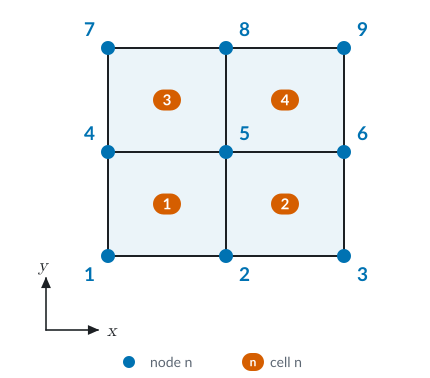
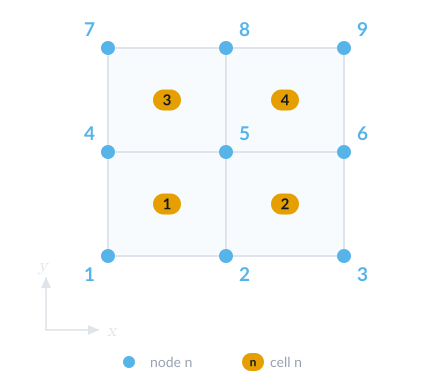

The cells of the grid can be described in the following way

```julia
cells = [
    Quadrilateral((1, 2, 5, 4)),
    Quadrilateral((2, 3, 6, 5)),
    Quadrilateral((4, 5, 8, 7)),
    Quadrilateral((5, 6, 9, 8)),
]
```

where each `Quadrilateral <: AbstractCell` is defined by the tuple of node IDs.
Additionally, the data structure `Grid` contains node-, cell-, facet-, and vertexsets.
Each of these sets is defined by a `Dict{String, OrderedSet}`.

Node- and cellsets are represented by an `OrderedSet{Int}`, giving a set of node or cell ID, respectively.

Facet- and vertexsets are represented by `OrderedSet{<:BoundaryIndex}`, where `BoundaryIndex` is a `FacetIndex` or `VertexIndex` respectively.
`FacetIndex` and `VertexIndex` wraps a `Tuple`, `(global_cell_id, local_facet_id)` and `(global_cell_id, local_vertex_id)`, where the local IDs
are defined according to the reference shapes, see [Reference shapes](@ref).

The highlighted facets, i.e. the two edges from node ID 3 to 6 and from 6 to 9, on the right hand side of our test mesh can now be described as

```julia
boundary_facets = [(3, 6), (6, 9)]
```
i.e. by using the node IDs of the reference shape vertices.

The first of these can be found as the 2nd facet of the 2nd cell.
```@repl
using Ferrite #hide
Ferrite.facets(Quadrilateral((2, 3, 6, 5)))
```

The unique representation of an entity is given by the sorted version of this tuple.
While we could use this information to construct a facet set, Ferrite can construct this
set by filtering based on the coordinates, using [`addfacetset!`](@ref).

## AbstractGrid

It can be very useful to use a grid type for a certain special case, e.g. mixed cell types, adaptivity, IGA, etc.
In order to define your own `<: AbstractGrid` you need to fulfill the `AbstractGrid` interface.
In case that certain structures are preserved from the `Ferrite.Grid` type, you don't need to dispatch on your own type, but rather rely on the fallback `AbstractGrid` dispatch.

### Example

As a starting point, we choose a minimal working example from the test suite:

```julia
struct SmallGrid{dim, N, C <: Ferrite.AbstractCell} <: Ferrite.AbstractGrid{dim}
    nodes_test::Vector{NTuple{dim, Float64}}
    cells_test::NTuple{N, C}
end
```

Here, the names of the fields as well as their underlying datastructure changed compared to the `Grid` type. This would lead to the fact, that any usage
with the utility functions and DoF management will not work. So, we need to feed into the interface how to handle this subtyped datastructure.
We start with the utility functions that are associated with the cells of the grid:

```julia
Ferrite.getcells(grid::SmallGrid) = grid.cells_test
Ferrite.getcells(grid::SmallGrid, v::Union{Int, Vector{Int}}) = grid.cells_test[v]
Ferrite.getncells(grid::SmallGrid{dim, N}) where {dim, N} = N
Ferrite.getcelltype(grid::SmallGrid) = eltype(grid.cells_test)
Ferrite.getcelltype(grid::SmallGrid, i::Int) = typeof(grid.cells_test[i])
```

Next, we define some helper functions that take care of the node handling.

```julia
Ferrite.getnodes(grid::SmallGrid) = grid.nodes_test
Ferrite.getnodes(grid::SmallGrid, v::Union{Int, Vector{Int}}) = grid.nodes_test[v]
Ferrite.getnnodes(grid::SmallGrid) = length(grid.nodes_test)
Ferrite.get_coordinate_eltype(::SmallGrid) = Float64
Ferrite.get_coordinate_type(::SmallGrid{dim}) where {dim} = Vec{dim, Float64}
Ferrite.nnodes_per_cell(grid::SmallGrid, i::Int = 1) = Ferrite.nnodes(grid.cells_test[i])
```

These definitions make many of Ferrite functions work out of the box, e.g. you can now call
`getcoordinates(grid, cellid)` on the `SmallGrid`.

Now, you would be able to assemble the heat equation example over the new custom `SmallGrid` type.
Note that this particular subtype isn't able to handle boundary entity sets and so, you can't describe boundaries with it.
In order to use boundaries, e.g. for Dirichlet constraints in the ConstraintHandler, you would need to dispatch the `AbstractGrid` sets utility functions on `SmallGrid`.

## Topology

A `Grid` stores each cell as a tuple of global node ids, but does not directly answer
questions like "which cells are neighbors of cell 5?" or "which facets are on the interior
of the domain?". This kind of connectivity information can be computed with
[`ExclusiveTopology`](@ref):

```@repl topology
using Ferrite #hide
grid = generate_grid(Quadrilateral, (3, 3));
topology = ExclusiveTopology(grid);
```

!!! warning "Experimental feature"
    `ExclusiveTopology` is an experimental feature and may change in future releases.
    It only works for conforming grids, i.e. grids without "hanging nodes", and requires
    the highest reference dimension among the cells to equal the spatial dimension
    (purely embedded grids, e.g. a shell grid of `Quadrilateral`s in 3D space, are not
    supported).

The examples in this section use the 3 × 3 quadrilateral grid constructed above, with
cells numbered row-wise starting in the bottom left corner.

### Neighborhood of a cell

Two cells are considered neighbors if they share at least one vertex. The name
*exclusive* refers to how the neighborhood is classified and stored: each pair of
neighboring cells is only connected through the highest-dimensional entity they share.
Cells sharing a face are *face neighbors*, cells sharing an edge, but no face, are *edge
neighbors*, and cells sharing only a vertex are *vertex neighbors*. In the grid below,
cell 5 has four edge neighbors (cells 2, 4, 6, and 8) and four vertex neighbors (cells 1,
3, 7, and 9). (Face neighbors only exist in 3D, and in 1D all neighbors are vertex
neighbors.)

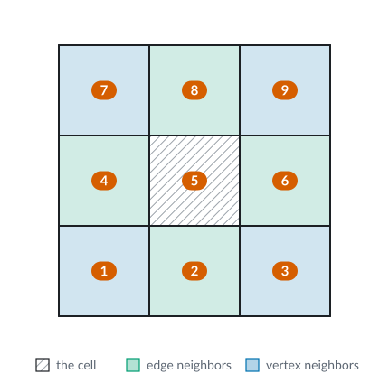
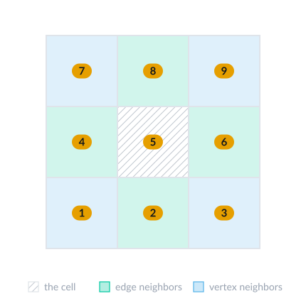

Neighborhood queries go through [`getneighborhood`](@ref). Passing a `CellIndex` returns
all neighboring cells, regardless of how they are connected:

```@repl topology
getneighborhood(topology, grid, CellIndex(5))
```

The returned collections are lightweight `AbstractVector` views -- treat them as
read-only and `collect` them if an independent copy is needed.

### Neighborhood of vertices, edges, and faces

Vertices, edges, and faces are addressed by a `(cell id, local entity id)` pair, wrapped
in [`VertexIndex`](@ref), [`EdgeIndex`](@ref), or [`FaceIndex`](@ref), where the local
numbering is defined by the cell's reference shape (see [Reference shapes](@ref)). Note
that vertices, edges, and faces denote entities of fixed dimension 0, 1, and 2,
independent of the spatial dimension of the grid, see
[Entity naming](@ref entity-naming-docs). In addition, [`FacetIndex`](@ref) addresses
*facets*, i.e. the entities separating cells: vertices in 1D, edges in 2D, and faces in
3D. Since an interior entity is part of more than
one cell it has multiple valid indices, one for each
cell containing it:

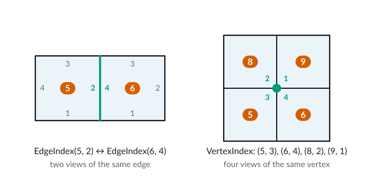
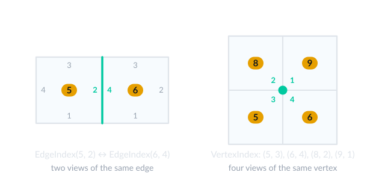

For these index types `getneighborhood` returns the *other* local views of the same
entity, i.e. how the entity is addressed from the neighboring cells:

```@repl topology
getneighborhood(topology, grid, FacetIndex(5, 2))
getneighborhood(topology, grid, VertexIndex(5, 3))
```

With the optional argument `include_self` set to `true` the queried entity itself is
also included, thus giving all equivalent representations:

```@repl topology
getneighborhood(topology, grid, VertexIndex(5, 3), true)
```

### The facet skeleton

A loop over all facets of all cells visits interior facets twice: once from each of the
two cells sharing it. [`facetskeleton`](@ref) instead returns an iterable with every
unique facet of the grid exactly once, where interior facets are represented by the cell
with the lowest cell id:

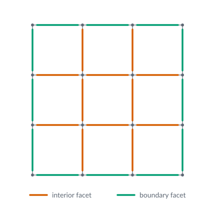
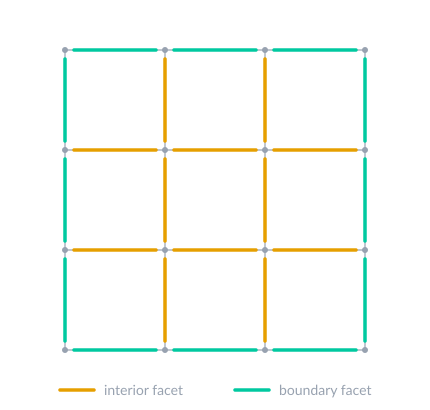

```@repl topology
skeleton = facetskeleton(topology, grid);
length(skeleton)
```

For this grid the skeleton contains 24 unique facets (12 interior and 12 on the
boundary), compared to the 9 × 4 = 36 cell-local facets. The skeleton is
useful when something should be computed once per facet, e.g. integrals over material
interfaces. For integrating jump and average terms over interior facets, as needed in
discontinuous Galerkin methods, the [`InterfaceIterator`](@ref) (which uses the topology
internally) is more convenient, see the
[Discontinuous Galerkin heat equation](@ref tutorial-dg-heat-equation) tutorial.

### Mixed reference dimensions

Grids mixing cells of different reference dimension are supported, as long as the
highest reference dimension equals the spatial dimension. As an example, consider a
`Line` cell attached to the right edge of a quadrilateral:

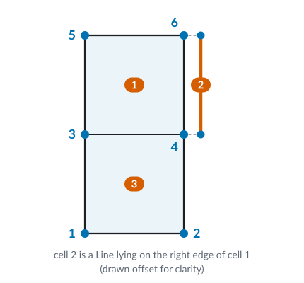
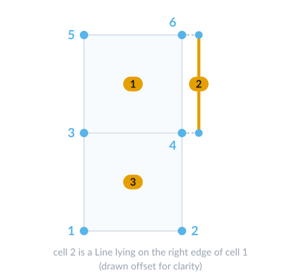

```@repl topology
nodes = Node.(Vec.([(0.0, 0.0), (1.0, 0.0), (0.0, 1.0), (1.0, 1.0), (0.0, 2.0), (1.0, 2.0)]));
cells = [
    Quadrilateral((3, 4, 6, 5)), # top quadrilateral (cell 1)
    Line((4, 6)),                # line on the right edge of cell 1 (cell 2)
    Quadrilateral((1, 2, 4, 3)), # bottom quadrilateral (cell 3)
];
mixed_grid = Grid(cells, nodes);
mixed_topology = ExclusiveTopology(mixed_grid);
```

The neighborhood is classified by the shared entity just as before, so the line cell is
an edge neighbor of cell 1. For `FacetIndex` queries the facet dimension is resolved
from the reference dimension of the indexed cell: the facets of the quadrilateral cell 1
are edges, and querying them finds the neighboring quadrilateral as well as the line
cell:

```@repl topology
getneighborhood(mixed_topology, mixed_grid, FacetIndex(1, 1)) # bottom edge
getneighborhood(mixed_topology, mixed_grid, FacetIndex(1, 2)) # right edge
```

To distinguish bulk neighbors from embedded ones, [`Ferrite.entity_dim`](@ref) and
[`Ferrite.entity_codim`](@ref) are useful: an edge of a quadrilateral (reference
dimension 2) has co-dimension 2 - 1 = 1, whereas the edge making up the whole line cell
(reference dimension 1) has co-dimension 0:

```@repl topology
Ferrite.entity_codim(mixed_grid, EdgeIndex(3, 3)) # facet of a bulk cell
Ferrite.entity_codim(mixed_grid, EdgeIndex(2, 1)) # embedded cell itself
```

This can be used to dispatch on the type of coupling, e.g.:

```julia
for facet_nr in 1:4, neighbor in getneighborhood(mixed_topology, mixed_grid, FacetIndex(1, facet_nr))
    if Ferrite.entity_codim(mixed_grid, neighbor) == 1
        # standard facet-to-facet coupling with another bulk cell (here cell 3)
    elseif Ferrite.entity_codim(mixed_grid, neighbor) == 0
        # coupling with an embedded cell (here the line cell 2)
    end
end
```

Note that these relations are not symmetric: seen from the line cell the facets are
vertices, so the same facet-based code cannot be reused from the embedded side:

```@repl topology
getneighborhood(mixed_topology, mixed_grid, FacetIndex(2, 1))
```

Finally, the bulk operations [`facetskeleton`](@ref) (and thereby
[`InterfaceIterator`](@ref)) do not support grids with mixed reference dimensions, since
they assume a common facet dimension across the whole grid.

### Vertex stars

[`vertex_star_stencils`](@ref) computes the *star* of every vertex in the grid: the
vertex itself and all vertices connected to it by an edge. The stencil of a specific
vertex is then extracted with [`getstencil`](@ref):

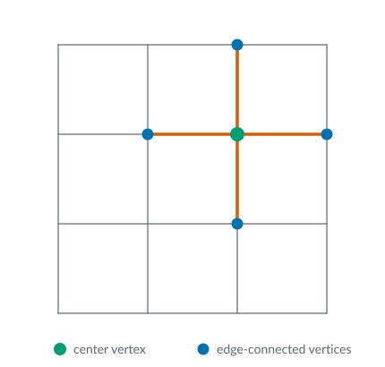
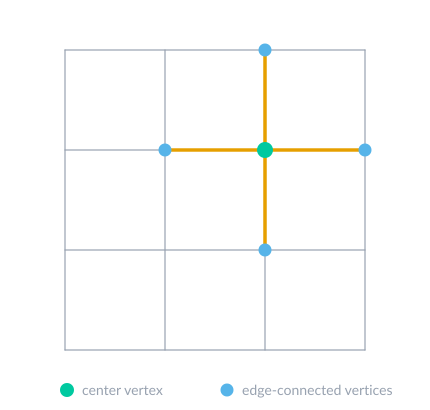

```@repl topology
stencils = vertex_star_stencils(topology, grid);
getstencil(stencils, grid, VertexIndex(5, 3))
```

The vertices in the star are given by their local views from the cells containing the
center vertex. Vertex stars are useful for node-based operations, e.g. constructing
stencils for finite-difference-like approximations.

### Topology-aware boundary sets

The topology is also used by [`addboundaryfacetset!`](@ref) and
[`addboundaryvertexset!`](@ref). In contrast to [`addfacetset!`](@ref) and
[`addvertexset!`](@ref), which consider all entities for which the passed predicate
holds, these restrict the search to entities on the domain boundary, i.e. entities of
facets without neighbors:

```@repl topology
addboundaryfacetset!(grid, topology, "east", x -> x[1] ≈ 1.0);
getfacetset(grid, "east")
```
