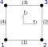

# Reference shapes

The reference shapes in Ferrite are used to define grid cells,
function interpolations (i.e. shape functions), and quadrature rules.
Currently, the following reference shapes are defined

* `RefLine`
* `RefTriangle`
* `RefQuadrilateral`
* `RefTetrahedron`
* `RefHexahedron`
* `RefPrism`
* `RefPyramid`

## Entity naming
Ferrite denotes the entities of a reference shape as follows

| Entity   | Description |
| :------- | :---------- |
| `Vertex` | 0-dimensional points in the reference shape. |
| `Edge`   | 1-dimensional entities connecting two vertices. |
| `Face`   | 2-dimensional entities whose boundary is defined by 3 or more edges. |
| `Volume` | 3-dimensional entity enclosed by faces. |

Note that a `Node` in Ferrite is not the same as a `Vertex`.
Vertices denote endpoints of edges, while nodes may also be be located in the middle
of edges (e.g. for a `QuadraticLine` cell).

To write dimensionally independent code, Ferrite also denotes entities by their
[*codimension*](https://en.wikipedia.org/wiki/Codimension),
defined relative the reference shape dimension. Specifically, Ferrite has the entities

| Entity   | Description |
| :------- | :---------- |
| `Cell`   | *0-codimensional* entity, i.e. the same as the reference shape. |
| `Facet`  | *1-codimensional* entity defining the boundary of cells. |

Standard use cases mostly deal with these codimensional entities,
such as [`CellValues`](@ref) and [`FacetValues`](@ref).

!!! note "Definition of codimension"
    In Ferrite, *codimension* is defined relative to the reference dimension of the specific entity.
    Note that other Finite Element codes may define it differently
    (e.g. relative the highest reference dimension in the grid).

## Entity numbering
Each reference shape defines the numbering of its `Vertex`, `Edge`, and `Face` entities,
where the `Edge` and `Face` entities are defined from their `Vertex` numbers.

### Example
The `RefQuadrilateral` is defined on the domain ``[-1, 1] \times [-1, 1]``
in the local ``\xi_1-\xi_2`` coordinate system.



The vertices of a `RefQuadrilateral` are then
```@example
using Ferrite #hide
Ferrite.reference_vertices(RefQuadrilateral)
```
and its edges are then defined as
```@example
using Ferrite #hide
Ferrite.reference_edges(RefQuadrilateral)
```
where the numbers refer to the vertex number.
Finally, this reference shape is 2-dimensional, so it only has a single `face`,
corresponding to the `Cell`,
```@example
using Ferrite #hide
Ferrite.reference_faces(RefQuadrilateral)
```
also defined in terms of its vertices.

As this is a 2-dimensional reference shape, the `facets` are the `edges`, i.e.
```@example
using Ferrite #hide
Ferrite.reference_facets(RefQuadrilateral)
```

!!! note "Not public API"
    The functions `reference_vertices`, `reference_edges`, `reference_faces`, and `reference_facets`
    are not public and only shown here to explain the numbering concept.
    The specific ordering may also change, and is therefore only documented in the
    [Developer documentation](/devdocs/reference_cells/).
